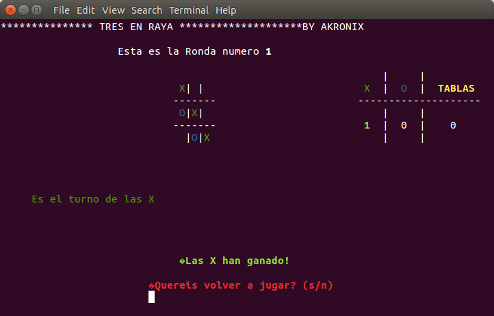

# 3enraya
Tic-Tac-Toe programmed in pascal.

I wrote this small program by my own when I was in first year of my career. So likely there will be some stupid things. 
I've learned many things since then and probably I could fix those noob errors, but I want to leave this program as it was created when I was 18th years old.

It was written in spanish and under windows 7 - 32 bits. 
It still can be compiled and run in linux, but you can experiment some character encoding issues. 
I have tried to compile it with fpc only. But I guess there should be no problems with other compilers.

Sample:

